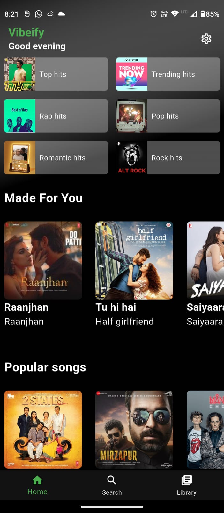
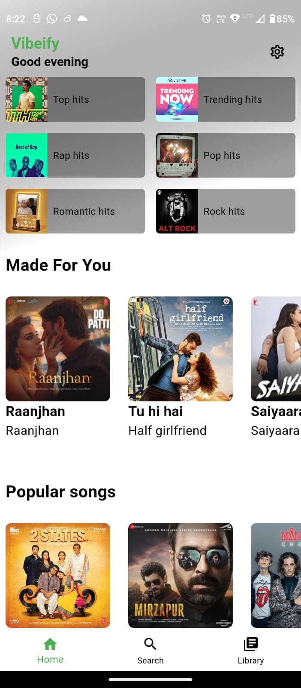
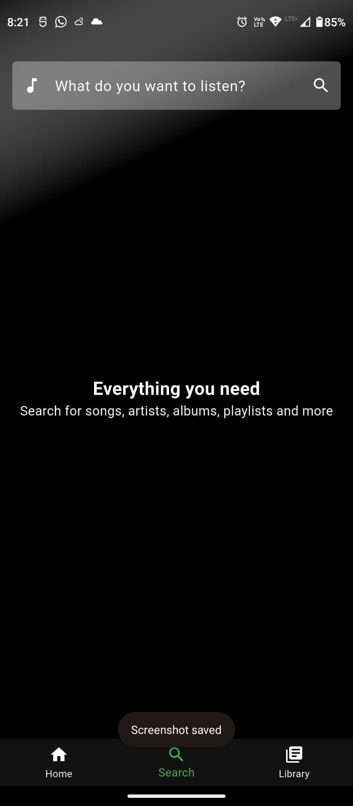
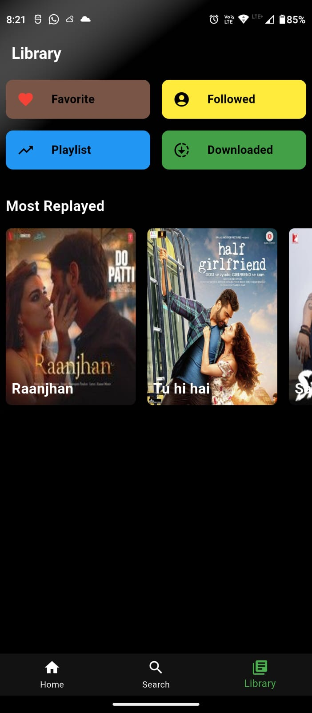
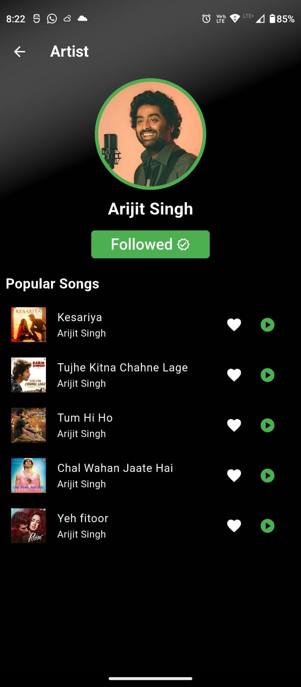
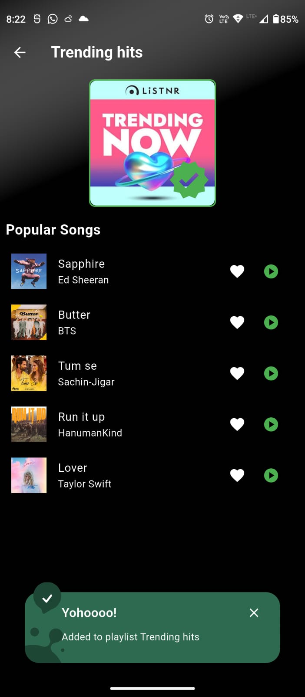
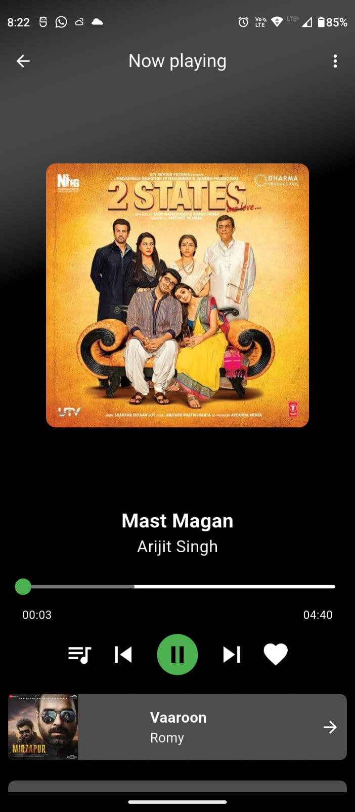
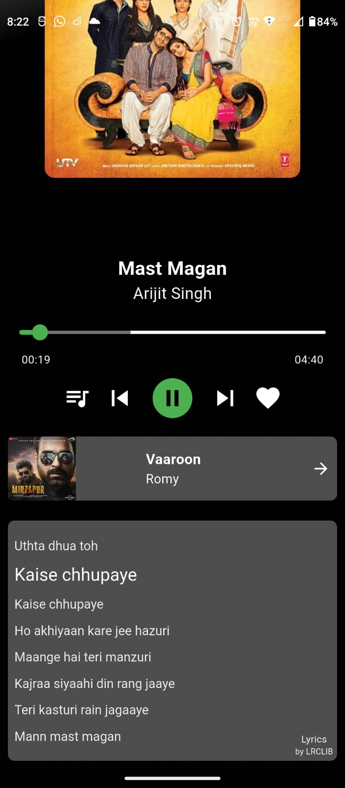
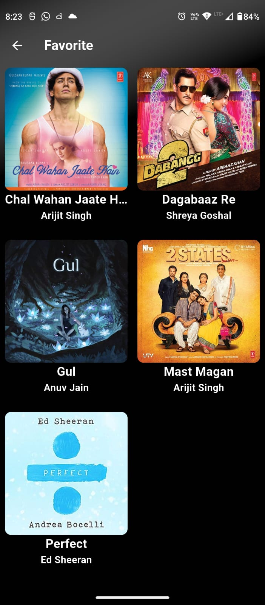

# 🎶 Vibeify — A Modern Flutter Music Player

Vibeify is a lightweight, feature-rich music player built with Flutter, focused on delivering a smooth audio experience with synced lyrics, persistent preferences, and intuitive design.

## 📱 Features

- 🎧 **Music Playback:** Stream, pause, skip, and control tracks with a dynamic MiniPlayer  
- 🔍 **Search Functionality:** Instantly find songs, artists, or albums  
- 🧠 **Smart Recommendations:** Curated playlists and similar songs   
- ❤️ **Like & Save:** Favorite tracks with persistent state via Hive   
- 📜 **Lyrics Integration:** Synced and plain text lyrics using `flutter_lyric` and LRCLIB API  
- 🌙 **Dynamic Theming:** Light/dark mode switching using `SharedPreferences` for persistent style  
- 📶 **Streaming Support:** Optimized for stable streaming with network fail-safes  
- 🔧 **Gradle Optimizations:** Improved build speed and error resolution for release APK  
- 🧠 **State Management:** Custom widget interaction without external state tools  
- 🖼️ **Custom UI:** Refined MiniPlayer with personalized background and overlay effects

## 🧰 Technical Highlights

### 🐝 Hive Integration

- Favorite songs
- Saved playlist
- Followed artist

### 🎭 Theme Preference (SharedPreferences)

- Light Theme
- Dark Theme

### Screenshots

    

    

   

